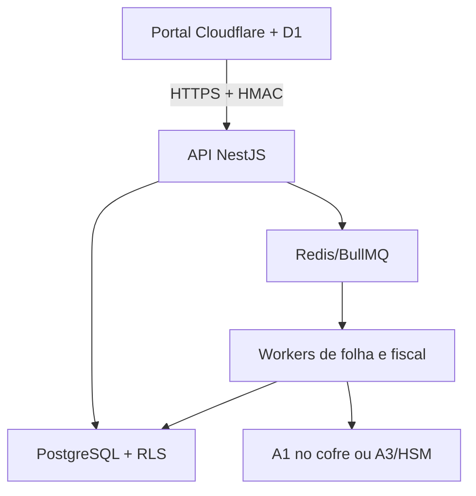

# Ativação da infraestrutura do Beta ERP Core

## Topologia de produção

O D1 permanece como fonte operacional durante a homologação. O botão
`Infraestrutura ERP > Copiar dados reais para homologação` importa snapshots
idempotentes e exclui todos os registros fictícios.

## Recursos necessários

| Recurso | Mínimo de homologação | Produção recomendada |
| --- | --- | --- |
| API | 1 contêiner, 1 vCPU, 512 MiB | 2+ réplicas, 1 vCPU, 1 GiB |
| Worker | 1 contêiner, 1 vCPU, 1 GiB | 2+ réplicas, 2 vCPU, 2–4 GiB |
| PostgreSQL | 2 vCPU, 4 GiB, 50 GB | Alta disponibilidade, PITR, pooler |
| Redis | 1 GB, persistência | Alta disponibilidade, TLS, `noeviction` |
| Rede | HTTPS gerenciado | WAF, logs e domínio exclusivo |
| Segredos | Cofre do provedor | Rotação, acesso mínimo e auditoria |
| Observabilidade | Logs estruturados | Métricas, alertas, traces e retenção |

Os números são ponto de partida. O dimensionamento final depende da quantidade
de empresas, funcionários, rubricas, XMLs e lotes simultâneos.

## Variáveis do núcleo

- `DATABASE_URL`: conexão PostgreSQL por TLS; usar usuário da aplicação, não
  superusuário.
- `REDIS_URL`: conexão Redis por TLS em produção.
- `ERP_SERVICE_CLIENT_ID`: nome do portal autorizado.
- `ERP_SERVICE_HMAC_SECRET`: segredo aleatório de pelo menos 32 bytes.
- `PAYLOAD_ENCRYPTION_KEY_BASE64`: chave aleatória de exatamente 32 bytes.
- `ERP_ALLOWED_ORIGINS`: URL pública do portal.
- `CERTIFICATE_PROVIDER`: `DISABLED`, `A1_PFX` ou `EXTERNAL_HSM`.
- `CERTIFICATE_PFX_BASE64` e `CERTIFICATE_PFX_PASSWORD`: somente no cofre,
  quando a opção for A1.

O script `scripts/generate-erp-secrets.mjs` gera os valores aleatórios. Execute
localmente e copie o resultado diretamente para o cofre; não envie os valores
por conversa ou e-mail.

## Variáveis do portal Cloudflare/Sites

- `ERP_CORE_BASE_URL`, por exemplo
  `https://api.betaconstrutora365.com.br`.
- `ERP_CORE_CLIENT_ID`, igual ao configurado na API.
- `ERP_CORE_HMAC_SECRET`, igual ao segredo armazenado na API.
- `ERP_CORE_TENANT_ID`, UUID da empresa. O tenant inicial da Beta é
  `8b6f6f46-8d0c-4c2b-9db2-325830bd3060`.

Sem essas quatro variáveis, o portal continua operando normalmente no D1 e
exibe o núcleo como pendente.

## Ordem de ativação

1. Escolher o provedor e criar uma conta de faturamento pertencente à empresa.
2. Criar PostgreSQL gerenciado, habilitar backup e recuperação ponto no tempo.
3. Criar Redis gerenciado com TLS, persistência e política `noeviction`.
4. Construir a imagem do `services/erp-core/Dockerfile` e publicá-la em um
   registry privado.
5. Executar o job de migração uma única vez para cada nova versão.
6. Subir workers e confirmar o heartbeat.
7. Subir pelo menos duas réplicas da API.
8. Publicar HTTPS em `api.betaconstrutora365.com.br`.
9. Registrar os quatro segredos de ponte no portal.
10. Conferir a Central `Infraestrutura ERP` e copiar somente os dados reais.
11. Comparar contagens, totais e hashes; repetir a cópia após correções.
12. Implementar escrita dupla/outbox e executar o corte definitivo em janela
    aprovada, com backup e plano de retorno.

## O que ainda exige decisão da empresa

- Provedor: AWS, Azure, Google Cloud ou plataforma gerenciada compatível com
  contêiner, PostgreSQL e Redis.
- Titular da conta de nuvem, domínio, faturamento e responsáveis por acesso.
- Certificado A1 ou A3/HSM e procurações eletrônicas.
- Região de hospedagem, prazo de retenção, RPO/RTO e política de backup.
- Contabilidade/RH responsáveis por homologar regras, incidências e eventos.

## Limites da etapa atual

- O assinador A1 está implementado e testado; A3 requer um agente junto ao
  token/HSM.
- Transmissão eSocial/EFD-Reinf ainda depende de XSD vigente, endpoints,
  procurações e homologação no ambiente restrito.
- A cópia D1 → PostgreSQL é para homologação e não muda a fonte oficial. O
  corte final exige escrita dupla/outbox para preservar alterações em trânsito.
